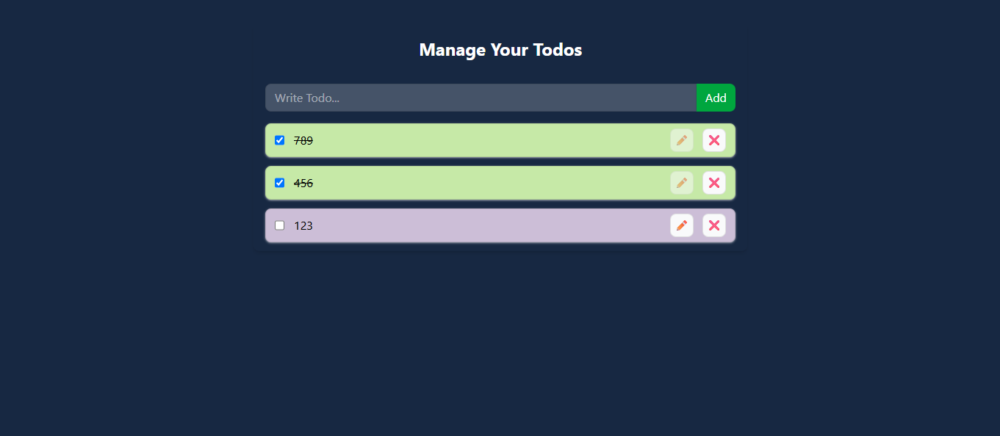
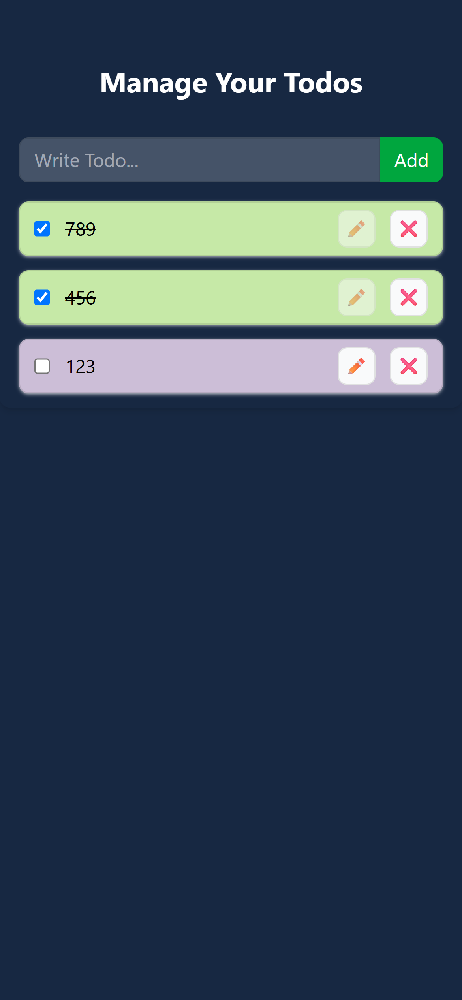

# 📝 Todo App — React + Context API + Local Storage

A simple, responsive Todo list application built with **React** to practice **Context API** for state management and **localStorage** for data persistence. Users can add, edit, complete, and delete todos, with all data automatically saved in the browser.

## 📸 Screenshots

| Desktop View | Mobile View |
|---|---|
|  |  |

## ✨ Features

- ➕ **Add Todos** — Quickly add new tasks via a simple input form
- ✏️ **Edit Todos** — Update the text of an existing (incomplete) todo in place
- ✅ **Toggle Complete** — Mark todos as complete/incomplete with a checkbox (adds a strikethrough style)
- ❌ **Delete Todos** — Remove todos you no longer need
- 💾 **Persistent Storage** — Todos are saved to `localStorage`, so your list survives page refreshes
- 📱 **Responsive Design** — Clean layout that adapts from desktop to mobile

## 🛠️ Tech Stack

- **React** (functional components + hooks: `useState`, `useEffect`, `useContext`)
- **Context API** — for sharing todo state and actions across components without prop drilling
- **Tailwind CSS** — for utility-first styling
- **Vite** — as the build tool / dev server
- **Browser `localStorage`** — for client-side data persistence

## 📂 Project Structure

```
TodoApp-Context-API-with-local-storage/
├── public/
├── Screenshots/
│   ├── Desktop-View.png
│   └── Mobile-View.png
├── src/
│   ├── components/
│   │   ├── TodoForm.jsx      # Form to add new todos
│   │   ├── TodoItem.jsx      # Single todo item (edit/toggle/delete)
│   │   └── index.js
│   ├── contexts/
│   │   ├── TodoContext.js    # Context definition + useTodo hook
│   │   └── index.js
│   ├── App.jsx                # Root component, holds todos state
│   ├── App.css
│   └── main.jsx
├── .gitignore
├── eslint.config.js
├── index.html
├── package.json
├── package-lock.json
├── README.md
└── vite.config.js
```

## ⚙️ How It Works

1. **State management**: `App.jsx` holds the `todos` array in state and defines `addTodo`, `updateTodo`, `deleteTodo`, and `toggleTodo` functions.
2. **Context API**: These state values and functions are provided to the component tree via `TodoProvider` (from `TodoContext.js`), so `TodoForm` and `TodoItem` can access them directly using the `useTodo()` hook — no prop drilling required.
3. **Persistence**:
   - On mount, a `useEffect` reads any saved todos from `localStorage` and loads them into state.
   - Another `useEffect` watches the `todos` state and writes it back to `localStorage` on every change.

## 🚀 Getting Started

### Prerequisites
- [Node.js](https://nodejs.org/) (v16 or higher recommended)
- npm (comes with Node.js)

### Installation

```bash
git clone <git clone git@github.com:AnkushSaral/React-Learning.git>
cd .\projects\TodoApp-Context-API-with-local-storage\
npm install
npm run dev
```

The app will be available at `http://localhost:5173` (or the port shown in your terminal).

### Build for Production

```bash
npm run build
```

## 🎯 Learning Focus

This project was built primarily to practice:
- Creating and consuming a React **Context** to avoid prop drilling
- Managing derived/local UI state (like edit mode) alongside shared context state
- Syncing React state with the browser's `localStorage` API using `useEffect`

## 📄 License

This project is open source and available for learning purposes.