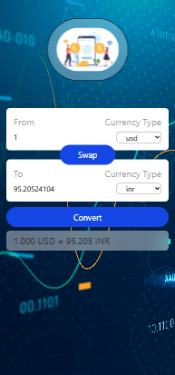

# Currency Converter

A modern and responsive Currency Converter built with **React**, **Tailwind CSS**, and a **Custom React Hook**. The application fetches real-time exchange rates and allows users to instantly convert currencies with a clean and intuitive interface. The project demonstrates practical usage of React Hooks such as `useState`, `useEffect`, `useCallback`, custom hooks, component reusability, and API integration.   

---

## 🚀 Features

* Real-time currency conversion
* Support for multiple international currencies
* Currency swap functionality
* Responsive design for desktop and mobile devices
* Reusable InputBox component
* Custom React Hook for API data fetching
* Automatic conversion when exchange rates change
* Clean and modern UI with Tailwind CSS
* Dynamic currency selection dropdown

---

## 📸 Screenshots

### Main Interface




### Currency Exchange Illustration


---

## 🛠️ Tech Stack

* React
* Vite
* Tailwind CSS
* JavaScript (ES6+)
* Currency API

---


## ⚙️ Installation

```bash
git clone git@github.com:AnkushSaral/React-Learning.git

cd .\projects\currency-converter-react\

npm install

npm run dev
```

The application will be available at:

```bash
http://localhost:5173
```

---

## 🌐 API Used

The project uses the free Currency API by Fawaz Ahmed:

```text
https://cdn.jsdelivr.net/npm/@fawazahmed0/currency-api
```

Example endpoint:

```text
https://cdn.jsdelivr.net/npm/@fawazahmed0/currency-api@latest/v1/currencies/usd.json
```

Exchange rates are fetched dynamically using a custom React hook. 

---

## 🧩 Core Components

### InputBox Component

Handles:

* Currency selection
* Amount input
* Reusable UI for both source and target currencies

Features:

* Controlled inputs
* Dynamic currency options
* Optional input disabling
* Accessible labels using React `useId()`


---

### Custom Hook: `useCurrencyInfo`

Responsible for:

* Fetching exchange rates
* Managing API requests
* Updating data when selected currency changes

Benefits:

* Separation of concerns
* Reusable logic
* Cleaner component structure


---

## 🔄 Application Workflow

1. User enters an amount.
2. User selects source currency.
3. User selects target currency.
4. Exchange rates are fetched automatically.
5. Conversion is calculated and displayed.
6. User can swap currencies with a single click.


---

## 📚 React Concepts Practiced

This project is excellent for learning:

* `useState`
* `useEffect`
* Custom Hooks
* Component Reusability
* Controlled Components
* Props
* API Fetching
* Event Handling
* State Management
* Responsive Design

---

## 🎯 Future Improvements

* Add loading indicators during API requests
* Error handling for failed API calls
* Searchable currency dropdown
* Currency flags
* Conversion history
* Dark mode support
* Favorite currencies
* Exchange rate charts
* Reverse conversion animation

---

## 👨‍💻 Author

**Ankush**

Built as a React learning project to gain hands-on experience with:

* React Hooks
* Custom Hooks
* API Integration
* Tailwind CSS
* Component Architecture

---

## 📄 License

This project is open-source and available under the MIT License.